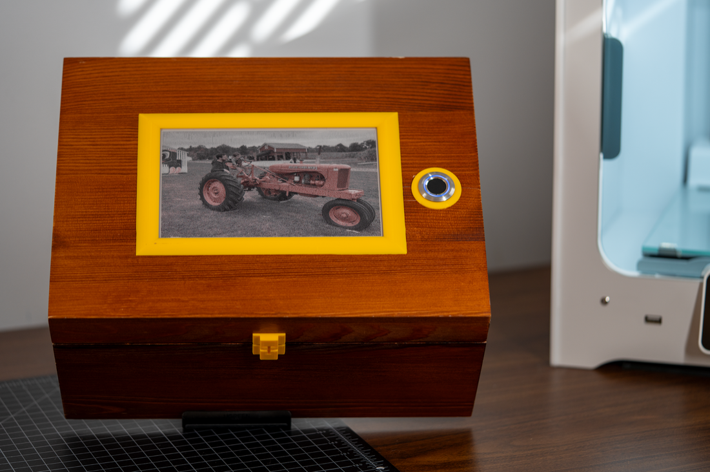
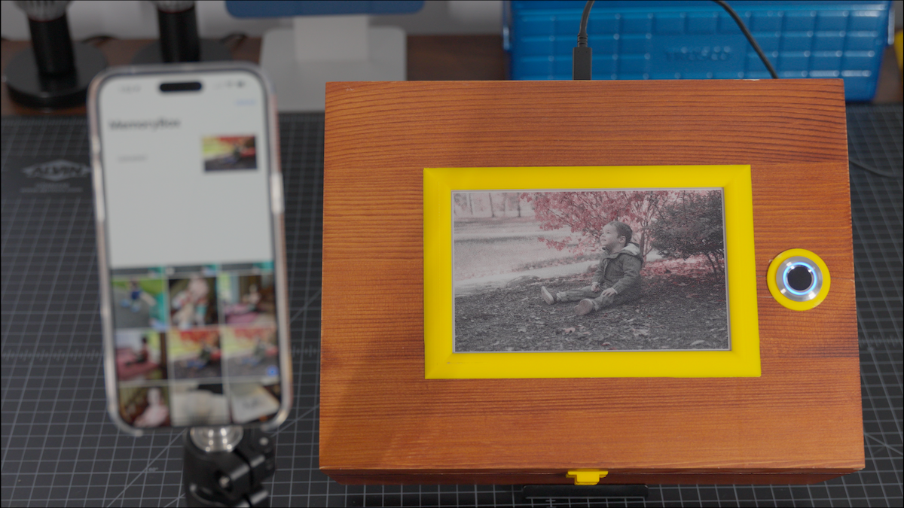
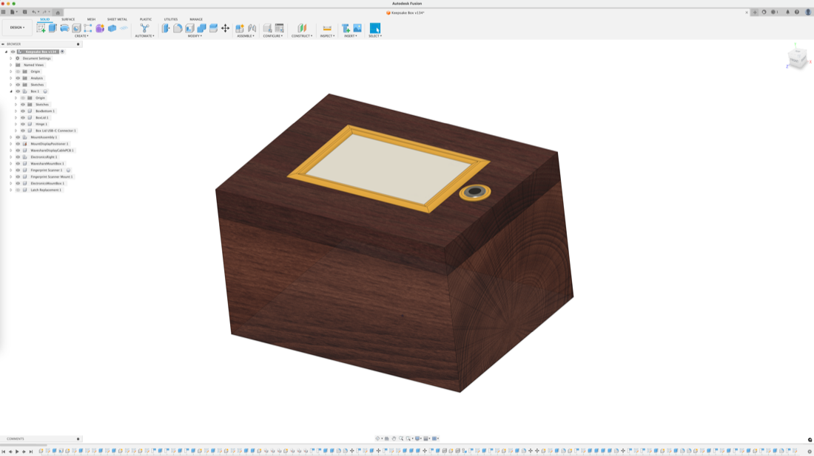
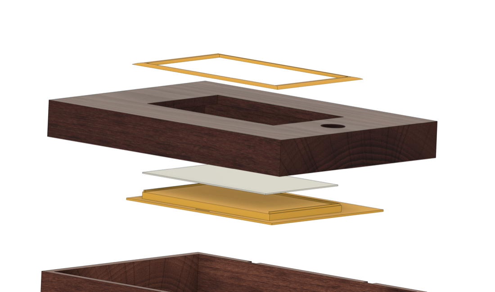
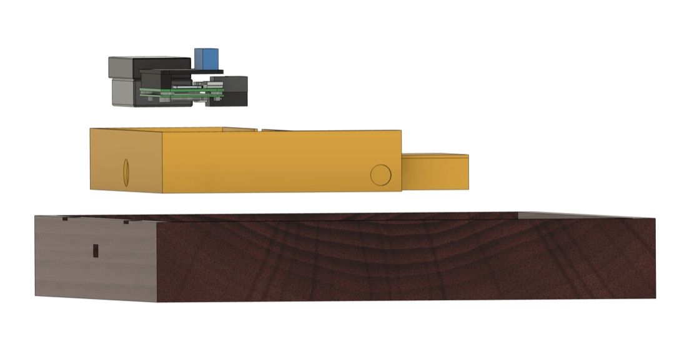
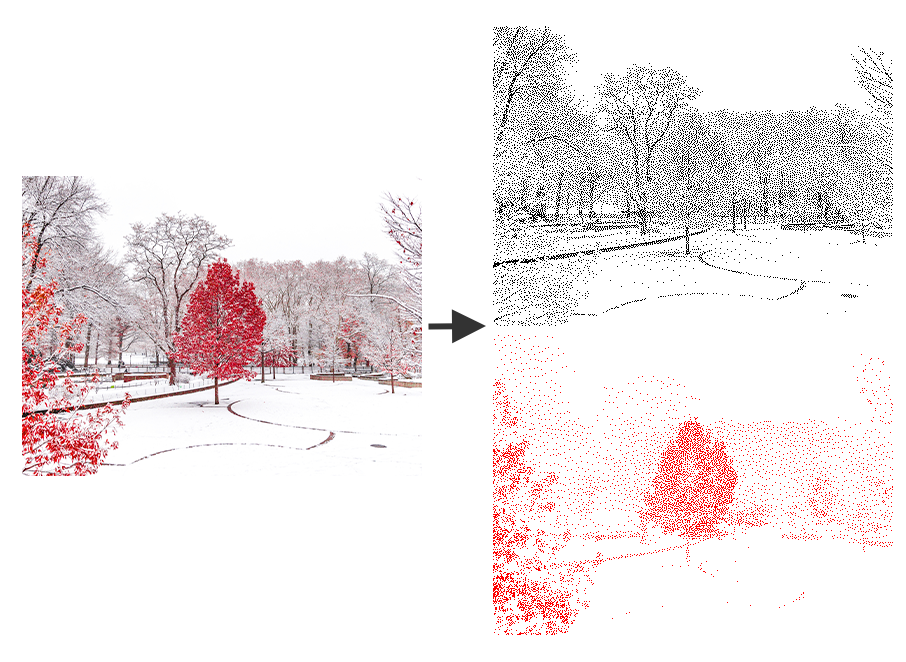
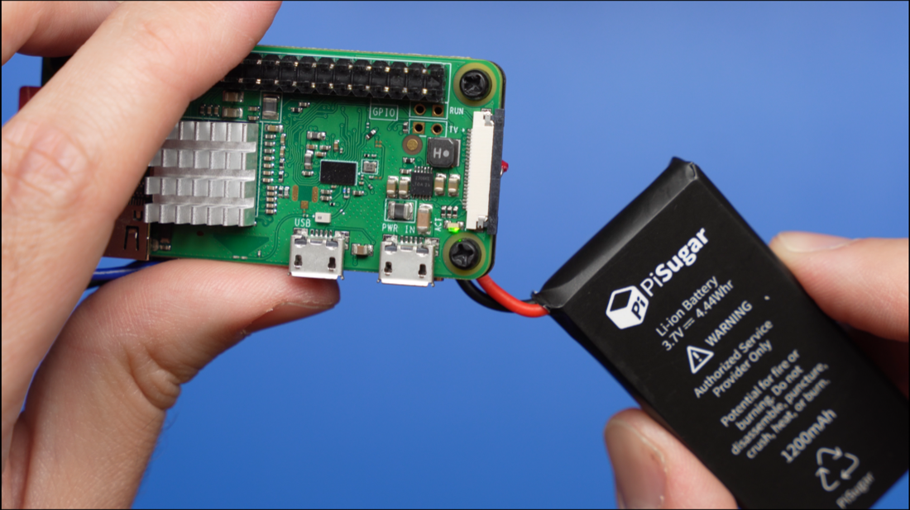

# Memory Box

A digital keepsake box with an e-paper display that shows memories throughout the day. Built using a Raspberry Pi Zero W, this box includes:

- 7.5" red/black/white e-paper display
- Fingerprint scanner for personalized photo retrieval
- Battery-powered operation with auto-shutdown protection
- Custom iPhone app for uploading and managing photos
- PostgreSQL database for storing photo metadata and tags on the Raspberry Pi

---

## Documentation

For build instructions, technical details, and more information about this project, check out [the blog post](https://www.mikebuss.com/posts/memory-box).

### iOS Application

An example of the iOS application is available in the `iOS` folder. This is NOT a complete implementation, but it demonstrates the basic functionality.

## License

This project is licensed under the MIT License - see the [LICENSE](LICENSE) file for details.